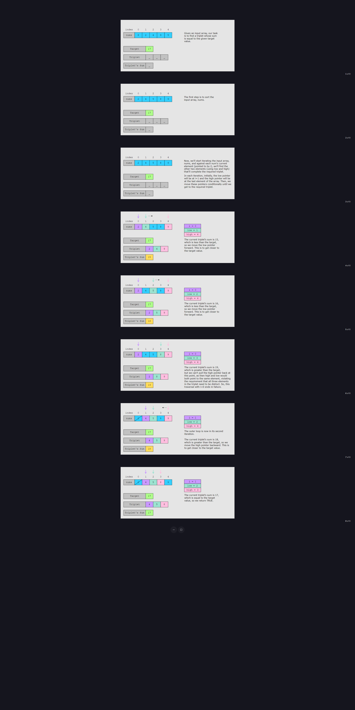

# Sum of Three Values

## Problem Statement <a href="#statement" id="statement"></a>

Given an array of integers, `nums`, and an integer value, `target`, determine if there are any three integers in `nums` whose sum is equal to the `target`, that is, `nums[i] + nums[j] + nums[k] == target`. Return TRUE if three such integers exist in the array. Otherwise, return FALSE.

> **Note:** A valid triplet consists of elements with _distinct_ indexes. This means, for the triplet `nums[i], nums[j]`, and `nums[k]`, `i` ≠= `j`, `i` ≠= `k` and `j` ≠= `k`.

## Examples

<figure><figcaption><p>Full Size</p></figcaption></figure>

## **Constraints**

* 3 ≤≤ `nums.length` ≤≤ 1000
* −10^3 ≤≤ `nums[i]` ≤≤ 10^3
* −10^3 ≤≤ `target` ≤≤ 10^3

## Solution <a href="#solution" id="solution"></a>

So far, you’ve probably brainstormed some approaches on how to solve this problem. Let’s explore some of these approaches and figure out which one to follow while considering time complexity and any implementation constraints.

### Naive Approach <a href="#naive-approach" id="naive-approach"></a>

The naive approach to solving this problem is to use three nested loops. Each nested loop starts at the index greater than its parent loop. For example, if we use the iterators `i`, `j`, and `k` in the loops, `j` will start from `i + 1`, and `k` will start from `j + 1`. This approach will check all the possible triplets to see if they sum up to the required target value.

We have the required solution, but at what cost? Since we’re using three nested loops, the overall time complexity for this solution is O(n^3). However, we aren’t using any extra space to get to the final output, so the space complexity is O(1).

### Optimized Approach Using Two Pointers <a href="#optimized-approach-using-two-pointers" id="optimized-approach-using-two-pointers"></a>

The two pointers pattern is used to solve a similar problem where we find two integers instead of three that sum up to the target value. We place one pointer at each end of a sorted array, the `low` pointer and the `high` pointer, and then traverse the array conditionally to find the two integers that sum up to the target value.

Now, in this problem, since we need to find the three integers that sum up to the target value, we slightly enhance the two pointers pattern. We use this pattern inside an additional loop. In the loop, we keep one value of the array with us and then look for the other two integers against this selected value that complete the triplet whose sum equals the target value.

First, we sort the input array, `nums`, in ascending order. This is because traversing an unsorted array would lead to a bad time complexity. If the input array is sorted, we can easily decide, depending on the sum of the current triplet, whether to move the `low` pointer toward the end, or, the `high` pointer toward the start. Next, we iterate over the elements in `nums` using the index `i`, where `i` << `length.nums - 2`. Against each `nums[i]`, we find the other two integers that complete the triplet whose sum equals the target value, that is, `nums[i] + nums[low] + nums[high] == target`. We do this by traversing `nums` with the `low` and `high` pointers. In each iteration, the traversal starts with the `low` pointer being at `nums[i+1]` and the `high` pointer at the last element of `nums`. Then, depending on the current sum value, we move these pointers as follows:

* If the sum of the triplet is equal to the `target`, we return TRUE. Otherwise, we continue.
* If the sum of the triplet is less than the `target`, we move the `low` pointer forward, that is, toward the end. The aim is to increase the value of the sum so that it gets closer or equal to the target value.
* If the sum of the triplet is greater than the `target`, we move the `high` pointer toward the start. The aim is to reduce the value of the sum so that it gets closer or equal to the target value.

We repeat this for each iteration until we get the required triplet.

> **Note:** As per the problem statement, each number in a triplet, `nums[i]`, `nums[low]`, and `nums[high]`, should be a different element of `nums`, so `i` can’t be equal to `low` or `high`, and `low` can’t be equal to `high`. Therefore, we keep the loop restricted to `length.nums - 2`.

## Just the Code


```java
class SumOfThree {
  public static boolean findSumOfThree(int nums[], int target) {
    // Sort the input list
    Arrays.sort(nums);
    int low, high, triples;

    // Fix one integer at a time and find the other two
    for (int i = 0; i < nums.length - 2; i++) {
      // Initialize the two pointers
      low = i + 1;
      high = nums.length - 1;

      // Traverse the list to find the triplet whose sum equals the target
      while (low < high) {
        triples = nums[i] + nums[low] + nums[high];

        // The sum of the triplet equals the target
        if (triples == target) {
          return true;
        }
        // The sum of the triplet is less than target, so move the low pointer forward
        else if (triples < target) {
          low++;
        }
        // The sum of the triplet is greater than target, so move the high pointer backward
        else {
          high--;
        }
      }
    }

    // No such triplet found whose sum equals the given target
    return false;
  }

  public static void main(String[] args) {
    int[][] numsList = {{3, 7, 1, 2, 8, 4, 5},
                       {-1, 2, 1, -4, 5, -3},
                       {2, 3, 4, 1, 7, 9},
                       {1, -1, 0},
                       {2, 4, 2, 7, 6, 3, 1}};

    int[] testList = {10, 7, 20, -1, 8};


    for (int i=0; i<testList.length; i++) {
      System.out.print(i+1);
      System.out.println(".\tInput array: " + Arrays.toString(numsList[i]));

      if (findSumOfThree(numsList[i], testList[i])) {
      System.out.println("\tSum for " + testList[i] + " exists ");
      } else {
      System.out.println("\tSum for " + testList[i] + " does not exist ");
      }

      System.out.println(PrintHyphens.repeat("-", 100));
    }

  }
}
```


## **Summary**

First, sort the array in ascending order. To find a triplet whose sum is equal to the target value, loop through the entire array. In each iteration:

1. Store the current array element and set up two pointers (`low` and `high`) to find the other two elements that complete the required triplet.
   * The `low` pointer is set to the current loop’s index + 1.
   * The `high` is set to the last index of the array.
2. Calculate the sum of array elements pointed to by the current loop’s index and the `low` and `high` pointers.
3. If the sum is equal to `target`, return TRUE.
4. If the sum is less than `target`, move the `low` pointer forward.
5. If the sum is greater than `target`, move the `high` pointer backward.

Repeat until the loop has processed the entire array. If, after processing the entire array, we don’t find any triplet that matches our requirement, we return FALSE.

### **Time Complexity** $$O(n^2)$$

In the solution above, sorting the array takes O(n log(n)) and the nested loop takes $$O(n^2)$$ to find the triplet. Here, n is the number of elements in the input array. Therefore, the total time complexity of this solution is $$O(n logn + n^2)$$, which simplifies to $$O(n^2)$$.

### **Space Complexity** $$O(1)$$

The space complexity of this solution, primarily, depends on the sorting algorithm we use. We use the built-in Java function, `Arrays.sort()`, so the space complexity of the provided solution is  $$O(1)$$ .
